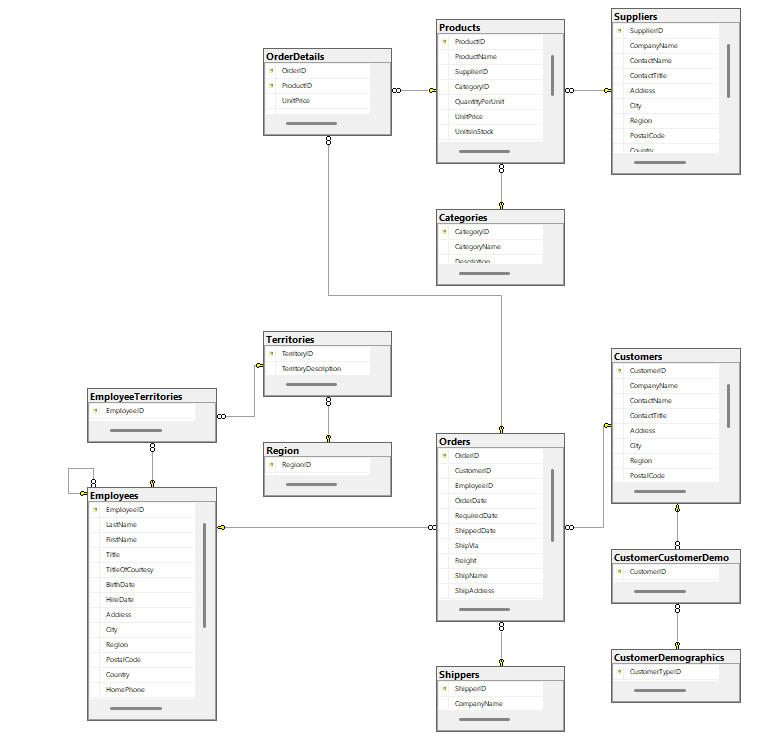

# 🗄️ NorthWind — Diseño OLTP y Data Warehouse

> Proyecto académico desarrollado en SQL Server que implementa un modelo de base de datos transaccional (OLTP) completamente normalizado en 3FN y su correspondiente modelo analítico (Data Warehouse) en esquema estrella, basado en la base de datos NorthWind.

---

## 👥 Integrantes del grupo

| Nombre | usuario |
|--------|--------- |
| Jorge Félix Zientarski Balderrama | cocozien |
| José Roberto Vargas Orellana | rovox |
| Ismael Peralta Fernandez | Isma9000 |
| Lizbeth Hualca Yavi | LizbethHY |
| Maria Yesica Sanchez Calle | YesicaSc2 |

---

## 📋 Descripción del proyecto

**Dominio de negocio:** Ventas y distribución internacional de alimentos y bebidas.

NorthWind es un sistema de gestión comercial para una empresa distribuidora internacional de alimentos y bebidas que cubre el ciclo completo de operaciones: administración de catálogo, gestión de clientes, procesamiento de pedidos, coordinación con proveedores y seguimiento de envíos.

**Componentes principales:**
- ✅ **OLTP**: Modelo relacional normalizado en 3FN para operaciones transaccionales
- ✅ **DW**: Esquema estrella dimensional orientado a análisis histórico de ventas

---

## � Documentación

La documentación está organizada en archivos independientes en la carpeta `docs/` para facilitar la navegación:

| Documento | Descripción |
|-----------|-------------|
| [01_dominio_negocio.md](docs/01_dominio_negocio.md) | Análisis del dominio de negocio |
| [02_estado_inicial.md](docs/02_estado_inicial.md) | Estado inicial de la base de datos |
| [03_normalizacion_OLTP.md](docs/03_normalizacion_OLTP.md) | Proceso de normalización del OLTP |
| [04_metricas_DW.md](docs/04_metricas_DW.md) | Métricas y KPIs del DW |
| **[06_modelo_oltp.md](docs/06_modelo_oltp.md)** | **Modelo OLTP detallado** |
| **[06_arquitectura_DW_detallada.md](docs/06_arquitectura_DW_detallada.md)** | **Arquitectura completa del DW** |
| **[07_despliegue_DW.md](docs/07_despliegue_DW.md)** | **Instrucciones de despliegue** |
| **[08_validacion_integridad.md](docs/08_validacion_integridad.md)** | **Validación de datos e integridad** |
| [05_instrucciones_despliegue.md](docs/05_instrucciones_despliegue.md) | Instrucciones iniciales (heredada) |

---

## 📁 Estructura del repositorio

```
DisenioDBDataWarehouse/
├── README.md                          (este archivo)
├── dacpac/
│   ├── Northwind.dacpac              (OLTP compilado)
│   └── Northwind_DW.dacpac           (DW compilado)
├── docs/                              (documentación subdividida)
│   ├── 01_dominio_negocio.md
│   ├── 02_estado_inicial.md
│   ├── 03_normalizacion_OLTP.md
│   ├── 04_metricas_DW.md
│   ├── 05_instrucciones_despliegue.md
│   ├── 06_modelo_oltp.md             (NUEVO: Modelo OLTP completo)
│   ├── 06_arquitectura_DW_detallada.md (NUEVO: DW completo basado en schema final)
│   ├── 07_despliegue_DW.md           (NUEVO: Instrucciones detalladas)
│   ├── 08_validacion_integridad.md   (NUEVO: Validación exhaustiva)
│   └── dw_design_summary.md
├── imgs/
│   ├── Diagrama DW.png               (Diagrama del modelo dimensional)
│   └── ModeloOLTP.png                (Diagrama E-R del OLTP)
└── scripts/
    ├── 01_OLPT_Schema.sql
    ├── 01_OLTP_Northwind_Full.sql
    ├── 02_DW_Schema_fase_Inicial.sql
    ├── 02_DW_Schema_final.sql        (✅ Versión FINAL del DW)
    ├── 02_Fase_Intermedia_northwind_dw.sql
    ├── 03_Carga_fact_Sales.sql
    ├── 04_Poblar_Dimensiones.sql
    ├── dim_customer.data.sql
    ├── dim_date.data.sql
    ├── dim_fact_sales.data.sql
    ├── dim_product.data.sql
    └── NorthWindDW.bak
```

---

## 🏗️ Modelo OLTP

El modelo OLTP implementa un sistema transaccional completamente normalizado en **Tercera Forma Normal (3FN)**.

### Características principales

- **Normalización**: 3FN (máxima)
- **Tablas**: 11 (Customers, Orders, OrderDetails, Products, Categories, Suppliers, Employees, Shippers, Region, Territories, EmployeeTerritories)
- **Registros**: ~3,257 (830 pedidos, 2,155 líneas de detalle)
- **Propósito**: Capturar operaciones transaccionales diarias

### Entidades principales

| Entidad | Descripción |
|---------|-------------|
| **Customers** | Empresas o personas que realizan pedidos |
| **Orders** | Pedidos registrados en el sistema |
| **OrderDetails** | Líneas de detalle de cada pedido |
| **Products** | Catálogo de productos para venta |
| **Employees** | Vendedores y personal de la empresa |
| **Suppliers** | Empresas proveedoras de productos |

**Ver documentación completa:** [📄 Modelo OLTP Detallado](docs/06_modelo_oltp.md)

> 

---

## 📊 Data Warehouse

El **Data Warehouse (DW)** es un modelo dimensional en **esquema estrella** diseñado para análisis histórico de ventas, desnormalizado y optimizado para consultas analíticas.

### Características principales

- **Normalización**: Desnormalizado (esquema estrella)
- **Grano**: Una fila por línea de pedido (OrderDetail)
- **Tablas**: 7 (1 tabla de hechos + 5 dimensiones + 1 config)
- **Registros FactSales**: ~2,155 (linealmente relacionados con OrderDetails del OLTP)
- **Base de datos**: `NorthWindDW` (versión final: `02_DW_Schema_final.sql`)

### Tabla de Hechos y Dimensiones

| Componente | Descripción |
|-----------|-------------|
| **FactSales** | Tabla de hechos con métricas: Quantity, UnitPrice, Discount, ExtendedPrice, Freight |
| **DimCustomer** | Clientes con información: CompanyName, City, Country, Region |
| **DimProduct** | Productos con categoría y proveedor denormalizados |
| **DimEmployee** | Empleados con estructura organizacional |
| **DimShipper** | Transportistas |
| **DimDate** | Dimensión temporal (calendario 1996-1998) |
| **DimShipLocation** | Ubicación de envío (desnormalizada) |

### Diagrama del Modelo Estrella

> 

**Ver documentación completa:** [📄 Arquitectura Detallada del DW](docs/06_arquitectura_DW_detallada.md)

---

## 🗂️ Scripts SQL

| Archivo | Versión | Descripción |
|---------|---------|-------------|
| `01_OLTP_Northwind_Full.sql` | ✅ Final | Creación y población completa del OLTP |
| `02_DW_Schema_final.sql` | ✅ **FINAL** | **Creación del esquema DW (versión definitiva)** |
| `03_Carga_fact_Sales.sql` | ✅ Final | Carga de la tabla de hechos |
| `04_Poblar_Dimensiones.sql` | ✅ Final | Población de dimensiones |
| `dim_*.data.sql` | Auxiliar | Scripts de datos específicos por dimensión |

**Ver documentación de despliegue:** [📄 Instrucciones de Despliegue](docs/07_despliegue_DW.md)

---

## 🚀 Inicio Rápido

### Opción A: Despliegue mediante SQL

```bash
# Ejecutar en este orden:
1. scripts/01_OLTP_Northwind_Full.sql     # Crear OLTP
2. scripts/02_DW_Schema_final.sql         # Crear DW
3. scripts/04_Poblar_Dimensiones.sql      # Llenar dimensiones
4. scripts/03_Carga_fact_Sales.sql        # Cargar hechos
```

### Opción B: Despliegue mediante DACPAC

1. Abrir **SQL Server Management Studio**
2. Click derecho en **Databases** → **Deploy Data-tier Application...**
3. Seleccionar `dacpac/Northwind.dacpac` (OLTP)
4. Repetir con `dacpac/Northwind_DW.dacpac` (DW)

**Ver detalles completos:** [📄 Instrucciones de Despliegue](docs/07_despliegue_DW.md)

---

## ✅ Validación

Para verificar que el despliegue fue exitoso:

```sql
-- Validar OLTP
SELECT COUNT(*) AS Clientes FROM Northwind.dbo.Customers;
SELECT COUNT(*) AS Pedidos FROM Northwind.dbo.Orders;
SELECT COUNT(*) AS DetallesPedidos FROM Northwind.dbo.OrderDetails;

-- Validar DW
SELECT COUNT(*) AS VentasFactSales FROM NorthWindDW.dbo.FactSales;
SELECT COUNT(*) AS Clientes FROM NorthWindDW.dbo.DimCustomer;

-- Reconciliación
SELECT 'OLTP' AS Fuente, SUM(Quantity * UnitPrice * (1 - Discount)) AS Total 
FROM Northwind.dbo.OrderDetails
UNION ALL
SELECT 'DW', SUM(ExtendedPrice) FROM NorthWindDW.dbo.FactSales;
```

**Ver guía completa de validación:** [📄 Validación de Integridad](docs/08_validacion_integridad.md)

---

## 📦 Archivos DACPAC

Para entornos sin acceso directo a scripts SQL, se proporcionan archivos compilados DACPAC:

- **`dacpac/Northwind.dacpac`**: Base de datos OLTP (v2024)
- **`dacpac/Northwind_DW.dacpac`**: Data Warehouse (v2024)

Estos archivos pueden ser deployados directamente desde SQL Server Management Studio.

---

## 🔗 Recursos Adicionales

### Diagramas

- **[Diagrama OLTP ER](imgs/ModeloOLTP.png)**: Entidad-Relación del modelo transaccional
- **[Diagrama DW Estrella](imgs/Diagrama%20DW.png)**: Esquema dimensional del Data Warehouse

### Documentación Completa

La documentación detallada está subdivida en archivos independientes en `docs/`:

1. **[Modelo OLTP](docs/06_modelo_oltp.md)** — Estructura, tablas, normalización 3FN
2. **[Arquitectura DW](docs/06_arquitectura_DW_detallada.md)** — Tablas de hechos, dimensiones, índices
3. **[Despliegue](docs/07_despliegue_DW.md)** — Instrucciones paso a paso (SQL y DACPAC)
4. **[Validación](docs/08_validacion_integridad.md)** — Pruebas y reconciliación de datos

---

## 📋 Resumen Ejecutivo

| Aspecto | OLTP | DW |
|--------|------|-----|
| **Modelo** | Relacional 3FN | Dimensional Estrella |
| **Propósito** | Operaciones transaccionales | Análisis histórico |
| **Tablas principales** | Customers, Orders, OrderDetails | FactSales + 5 Dimensiones |
| **Registros** | ~3,257 | ~2,155 (FactSales) |
| **Optimización** | Escribir (CRUD) | Leer (Analytics) |
| **Normalización** | Máxima (3FN) | Desnormalización (Estrella) |

---

## 📝 Notas de Implementación

- ✅ El **schema final del DW** está en `scripts/02_DW_Schema_final.sql` (recomendado)
- ✅ Todos los scripts están probados y validados
- ✅ Los datos coinciden entre OLTP y DW (reconciliación verificada)
- ✅ Índices optimizados en FactSales para consultas analíticas
- ✅ Documentación completa con ejemplos SQL

---

## 🤝 Contribuciones

Este es un proyecto académico. Para cambios importantes:

1. Crear una rama: `git checkout -b feature/descripcion`
2. Hacer commit: `git commit -am 'Descripción del cambio'`
3. Push: `git push origin feature/descripcion`
4. Abrir Pull Request

---

## 📧 Contacto

Para preguntas sobre el proyecto, contactar a los integrantes del equipo listados al inicio de este documento.

---

**Última actualización**: Mayo 2026  
**Estado**: Completo ✅


