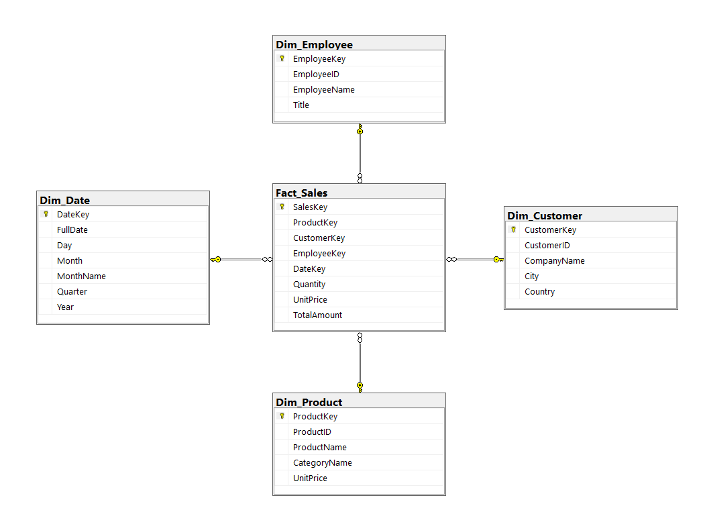

# 🗄️ NorthWind — Diseño OLTP y Data Warehouse

> Proyecto académico desarrollado en SQL Server que implementa un modelo de base de datos transaccional (OLTP) y su correspondiente modelo analítico (Data Warehouse) basado en la base de datos NorthWind.

---

## 👥 Integrantes del grupo

| Nombre |
|--------|
| Jorge Felix Zientarki Balderrama |
| Jose Roberto Vargas Orellana |
| Ismael Peralta Fernandez |
| Lizbeth Hualca Yavi |
| Maria Yesica Sanchez Calle |

---

## 📋 Descripción del proyecto

**Dominio de negocio:** Ventas y distribución internacional de alimentos y bebidas.

NorthWind es un sistema de gestión comercial para una empresa distribuidora internacional de alimentos y bebidas. El sistema cubre el ciclo completo de ventas: desde la administración del catálogo de productos y la gestión de clientes, hasta el procesamiento de pedidos, la coordinación con proveedores y el seguimiento de envíos a través de transportistas externos.

Como parte de este proyecto se diseñó:
- Un **modelo OLTP** completamente normalizado en Tercera Forma Normal (3FN).
- Un **Data Warehouse** en esquema estrella orientado al análisis histórico de ventas.

### Resumen del dominio de negocio

| Aspecto | Detalle |
|---------|---------|
| **Sector** | Distribución mayorista de productos alimenticios |
| **Entidades principales** | Clientes, Productos, Empleados, Órdenes, Proveedores |

**Reglas de negocio:**
- Cada orden pertenece a un cliente y es atendida por un empleado.
- Un producto pertenece a una categoría y tiene un proveedor.
- Las órdenes tienen múltiples líneas de detalle (producto, cantidad, precio, descuento).
- El precio extendido = `Quantity × UnitPrice × (1 - Discount)`.

---

## 📁 Estructura del repositorio

```
NorthWindDB/
├── README.md
├── dacpac/
│   ├── Northwind.dacpac
│   └── Northwind_DW.dacpac
├── docs/
│   ├── 01_dominio_negocio.md
│   ├── 02_estado_inicial.md
│   ├── 03_normalizacion_OLTP.md
│   ├── 04_metricas_DW.md
│   ├── 05_instrucciones_des...
│   └── dw_design_summary...
├── imgs/
│   ├── ModeloDW.png
│   └── ModeloOLTP.png
└── scripts/
    ├── 01_OLTP_Schema.sql
    ├── 01_OLTP_Northwind_Full.sql
    ├── 02_DW_Schema.sql
    ├── 03_Carga_fact_Sales.sql
    ├── 04_Poblar_Dimensiones.sql
    └── northwind_dw.sql
```

---

## 🏗️ Modelo OLTP

### Diagrama Entidad-Relación

El siguiente diagrama representa el modelo físico de la base de datos NorthWind, generado a partir del esquema implementado en SQL Server. Muestra las tablas del sistema, sus atributos, claves primarias, claves foráneas y las relaciones de integridad referencial entre ellas.

> 📌 **Para ver el diagrama ER**, abre el archivo [`imgs/ModeloOLTP.png`](imgs/ModeloOLTP.png) incluido en el repositorio.
>
> También puedes verlo directamente aquí:
>
> 

### Entidades principales

| Entidad | Descripción |
|---------|-------------|
| `Customers` | Empresas o personas que realizan pedidos |
| `Orders` | Pedidos registrados en el sistema |
| `OrderDetails` | Líneas de detalle de cada pedido |
| `Products` | Catálogo de productos disponibles para venta |
| `Categories` | Agrupación de productos por tipo |
| `Suppliers` | Empresas proveedoras de productos |
| `Employees` | Vendedores y personal de la empresa |
| `Shippers` | Empresas de transporte y envío |
| `Region / Territories` | Organización territorial de las ventas |

### Claves primarias y foráneas destacadas

| Tabla | Clave Primaria | Claves Foráneas |
|-------|---------------|-----------------|
| `Orders` | `OrderID` | `CustomerID`, `EmployeeID`, `ShipperID` |
| `OrderDetails` | `OrderID + ProductID` | `OrderID`, `ProductID` |
| `Products` | `ProductID` | `CategoryID`, `SupplierID` |
| `Employees` | `EmployeeID` | `ReportsTo` (auto-referencia) |
| `Territories` | `TerritoryID` | `RegionID` |

### Tipos de datos principales utilizados

| Tipo | Uso |
|------|-----|
| `INT` / `SMALLINT` | Identificadores (PKs y FKs) |
| `NVARCHAR(n)` | Nombres, descripciones, direcciones |
| `MONEY` / `DECIMAL` | Precios, importes monetarios |
| `REAL` | Descuentos (valor entre 0 y 1) |
| `SMALLINT` | Cantidades |
| `DATETIME` | Fechas de orden, envío, entrega |
| `BIT` | Banderas booleanas |

### Normalización

El modelo cumple con los requisitos de la **Tercera Forma Normal (3FN)**:

**Primera Forma Normal (1FN):**
- Todos los atributos almacenan valores atómicos e indivisibles.
- No existen grupos repetidos ni columnas multivalor.
- Cada tabla cuenta con una clave primaria claramente definida.

**Segunda Forma Normal (2FN):**
- Todos los atributos no clave dependen funcionalmente de la totalidad de la clave primaria.
- En `OrderDetails` (clave compuesta `OrderID + ProductID`), los campos `UnitPrice`, `Quantity` y `Discount` dependen de ambas columnas en conjunto.

**Tercera Forma Normal (3FN):**
- No existen dependencias transitivas entre atributos no clave.
- `CategoryName` no se almacena en `Products` sino en `Categories`, referenciada mediante `CategoryID`.
- Los datos del proveedor residen en `Suppliers` y no se repiten en `Products`.
- Esto garantiza que un cambio en el nombre de una categoría o proveedor se actualice en un único lugar.

### Reglas de negocio implementadas

Las siguientes restricciones están implementadas directamente en el esquema mediante `CHECK` y `FOREIGN KEY`:

```sql
-- El descuento debe estar entre 0% y 100%
CHECK (Discount >= 0 AND Discount <= 1)

-- La cantidad pedida debe ser mayor a cero
CHECK (Quantity > 0)

-- Los precios no pueden ser negativos
CHECK (UnitPrice >= 0)

-- La fecha de nacimiento del empleado debe ser anterior a la fecha actual
CHECK (BirthDate < GETDATE())
```

---

## 📊 Data Warehouse

### Diagrama Estrella

El modelo dimensional fue diseñado en **esquema estrella**, orientado al análisis histórico de ventas.

> 📌 **Para ver el diagrama del DW**, abre el archivo [`imgs/ModeloDW.png`](imgs/ModeloDW.png) incluido en el repositorio.
>
> También puedes verlo directamente aquí:
>
> 

### Tabla de Hechos

| Tabla | Descripción |
|-------|-------------|
| `Fact_Sales` | Registra cada línea de venta con sus métricas numéricas y referencias a todas las dimensiones |

**Métricas de la Fact Table:**

| Métrica | Fórmula / Descripción |
|---------|----------------------|
| `Quantity` | Cantidad de unidades vendidas |
| `UnitPrice` | Precio unitario al momento de la venta |
| `Discount` | Descuento aplicado (0 a 1) |
| `ExtendedPrice` | `Quantity × UnitPrice × (1 - Discount)` |
| `Freight` | Costo de envío de la orden |

### Dimensiones

| Dimensión | Atributos principales |
|-----------|----------------------|
| `Dim_Customer` | CustomerID, CompanyName, City, Country, Region |
| `Dim_Product` | ProductID, ProductName, CategoryName, SupplierName |
| `Dim_Employee` | EmployeeID, FullName, Title, Country |
| `Dim_Shipper` | ShipperID, CompanyName |
| `Dim_Date` | DateKey, Date, Day, Month, Quarter, Year, MonthName |

### Identificación de Hechos y Dimensiones

| Elemento | Tipo | Justificación |
|----------|------|---------------|
| Líneas de `OrderDetails` | **Hecho** | Contienen métricas cuantificables (cantidad, precio, descuento) |
| `Customers` | **Dimensión** | Describe al comprador (quién compra) |
| `Products` + `Categories` | **Dimensión** | Describe el producto vendido (qué se vende) |
| `Employees` | **Dimensión** | Describe al vendedor (quién atiende) |
| `Shippers` | **Dimensión** | Describe el transporte (cómo se envía) |
| Fechas de `Orders` | **Dimensión** | Permite análisis temporal (cuándo) |

> **El DW está orientado a análisis histórico**, no replica el OLTP. Se aplanan relaciones, se desnormalizan dimensiones y se precalculan métricas para optimizar las consultas analíticas.

---

## 🗂️ Scripts SQL

| Archivo | Descripción |
|---------|-------------|
| `scripts/01_OLTP_Schema.sql` | Creación del esquema OLTP (tablas, PKs, FKs, CHECKs) |
| `scripts/01_OLTP_Northwind_Full.sql` | Script completo OLTP con datos de prueba (≥20 registros por tabla principal) |
| `scripts/02_DW_Schema.sql` | Creación del esquema del Data Warehouse |
| `scripts/03_Carga_fact_Sales.sql` | Carga de la tabla de hechos `Fact_Sales` |
| `scripts/04_Poblar_Dimensiones.sql` | Población de las tablas de dimensiones (ETL simple) |
| `scripts/northwind_dw.sql` | Script integrado del DW |

---

## 🚀 Instrucciones para desplegar

### Requisitos previos

- SQL Server 2019 o superior (o SQL Server Express).
- SQL Server Management Studio (SSMS) o Azure Data Studio.
- (Opcional) Visual Studio con SQL Server Data Tools (SSDT) para el DACPAC.

### Opción A — Despliegue mediante scripts SQL

**Paso 1: Crear la base de datos OLTP**

```sql
-- Ejecutar en orden:
-- 1. Crear y poblar el OLTP completo
scripts/01_OLTP_Northwind_Full.sql
```

**Paso 2: Crear el Data Warehouse**

```sql
-- Ejecutar en orden:
scripts/02_DW_Schema.sql
scripts/04_Poblar_Dimensiones.sql
scripts/03_Carga_fact_Sales.sql
```

**Paso 3: Validar integridad referencial**

```sql
-- Verificar que no hayan huérfanos en OrderDetails
SELECT od.OrderID
FROM OrderDetails od
LEFT JOIN Orders o ON od.OrderID = o.OrderID
WHERE o.OrderID IS NULL;

-- Verificar métricas del DW vs OLTP
SELECT SUM(ExtendedPrice) FROM Fact_Sales;
SELECT SUM(Quantity * UnitPrice * (1 - Discount)) FROM OrderDetails;
```

### Opción B — Despliegue mediante DACPAC

1. Abrir SQL Server Management Studio (SSMS).
2. Conectarse a la instancia de SQL Server.
3. Click derecho sobre **Databases** → **Deploy Data-tier Application...**
4. Seleccionar el archivo correspondiente:
   - `dacpac/Northwind.dacpac` → para el OLTP
   - `dacpac/Northwind_DW.dacpac` → para el Data Warehouse
5. Seguir el asistente y confirmar el despliegue.
6. Verificar que las bases de datos aparezcan correctamente en el explorador de objetos.

---

## ✅ Validación de datos

### OLTP — Integridad referencial

```sql
-- Verificar cascada de FKs
EXEC sp_fkeys 'Orders';

-- Confirmar restricciones CHECK activas
SELECT name, definition
FROM sys.check_constraints
WHERE parent_object_id = OBJECT_ID('OrderDetails');
```

### DW — Consistencia de datos

```sql
-- Total ventas DW vs OLTP (deben coincidir)
SELECT 'OLTP' AS fuente, SUM(Quantity * UnitPrice * (1 - Discount)) AS total
FROM OrderDetails
UNION ALL
SELECT 'DW' AS fuente, SUM(ExtendedPrice) AS total
FROM Fact_Sales;

-- Conteo de registros por dimensión
SELECT 'Dim_Customer' AS dim, COUNT(*) FROM Dim_Customer
UNION ALL SELECT 'Dim_Product', COUNT(*) FROM Dim_Product
UNION ALL SELECT 'Dim_Employee', COUNT(*) FROM Dim_Employee
UNION ALL SELECT 'Dim_Date', COUNT(*) FROM Dim_Date;
```

---

## 📦 Proyecto DACPAC

El proyecto fue creado en **Visual Studio con SQL Server Data Tools (SSDT)**:

1. Se importó el esquema del OLTP y del DW.
2. Se generaron los archivos `.dacpac` mediante **Build** del proyecto.
3. Se verificó que el proyecto compila sin errores.

Los archivos generados están en la carpeta `dacpac/`:
- `Northwind.dacpac` — Base de datos transaccional OLTP.
- `Northwind_DW.dacpac` — Data Warehouse.

---
