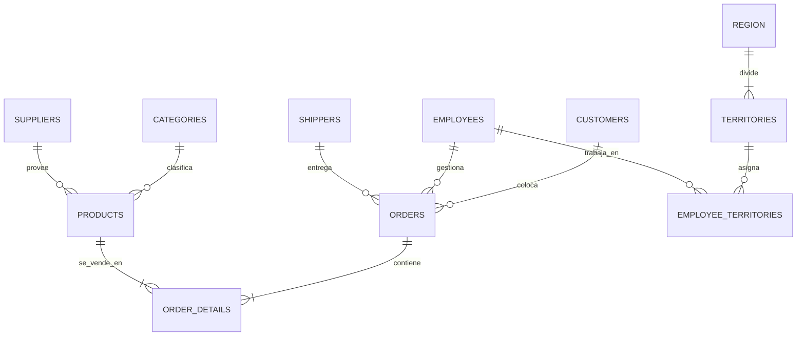

# Estado inicial de la base de datos
Para entender la base de datos y sus caracteristicas se ejecuto el siguiente script:

´´´sql
USE Northwind;
GO

-- ============================================
-- 1. LISTADO DE TODAS LAS TABLAS
-- ============================================
SELECT 
    t.TABLE_SCHEMA,
    t.TABLE_NAME,
    t.TABLE_TYPE
FROM INFORMATION_SCHEMA.TABLES t
WHERE t.TABLE_TYPE = 'BASE TABLE'
ORDER BY t.TABLE_SCHEMA, t.TABLE_NAME;

-- ============================================
-- 2. ESTRUCTURA DE CADA TABLA (columnas, tipos, PKs, FKs)
-- ============================================
SELECT 
    c.TABLE_SCHEMA,
    c.TABLE_NAME,
    c.COLUMN_NAME,
    c.DATA_TYPE,
    c.CHARACTER_MAXIMUM_LENGTH,
    c.IS_NULLABLE,
    CASE 
        WHEN pk.COLUMN_NAME IS NOT NULL THEN 'PK'
        ELSE ''
    END AS PrimaryKey,
    CASE 
        WHEN fk.COLUMN_NAME IS NOT NULL THEN 'FK'
        ELSE ''
    END AS ForeignKey,
    fk.REFERENCED_TABLE_NAME,
    fk.REFERENCED_COLUMN_NAME
FROM INFORMATION_SCHEMA.COLUMNS c
LEFT JOIN (
    SELECT 
        ku.TABLE_SCHEMA,
        ku.TABLE_NAME,
        ku.COLUMN_NAME
    FROM INFORMATION_SCHEMA.TABLE_CONSTRAINTS tc
    JOIN INFORMATION_SCHEMA.KEY_COLUMN_USAGE ku 
        ON tc.CONSTRAINT_NAME = ku.CONSTRAINT_NAME
    WHERE tc.CONSTRAINT_TYPE = 'PRIMARY KEY'
) pk ON c.TABLE_SCHEMA = pk.TABLE_SCHEMA 
    AND c.TABLE_NAME = pk.TABLE_NAME 
    AND c.COLUMN_NAME = pk.COLUMN_NAME
LEFT JOIN (
    SELECT 
        ku.TABLE_SCHEMA,
        ku.TABLE_NAME,
        ku.COLUMN_NAME,
        ccu.TABLE_NAME AS REFERENCED_TABLE_NAME,
        ccu.COLUMN_NAME AS REFERENCED_COLUMN_NAME
    FROM INFORMATION_SCHEMA.TABLE_CONSTRAINTS tc
    JOIN INFORMATION_SCHEMA.KEY_COLUMN_USAGE ku 
        ON tc.CONSTRAINT_NAME = ku.CONSTRAINT_NAME
    JOIN INFORMATION_SCHEMA.CONSTRAINT_COLUMN_USAGE ccu
        ON tc.CONSTRAINT_NAME = ccu.CONSTRAINT_NAME
    WHERE tc.CONSTRAINT_TYPE = 'FOREIGN KEY'
) fk ON c.TABLE_SCHEMA = fk.TABLE_SCHEMA 
    AND c.TABLE_NAME = fk.TABLE_NAME 
    AND c.COLUMN_NAME = fk.COLUMN_NAME
ORDER BY c.TABLE_SCHEMA, c.TABLE_NAME, c.ORDINAL_POSITION;

-- ============================================
-- 3. RELACIONES (DIAGRAMA DE FKs) - ya la tienes, pero por completitud
-- ============================================
SELECT 
    fk.name AS ConstraintName,
    OBJECT_NAME(fk.parent_object_id) AS TableName,
    c1.name AS ColumnName,
    OBJECT_NAME(fk.referenced_object_id) AS ReferencedTable,
    c2.name AS ReferencedColumn
FROM sys.foreign_keys fk
INNER JOIN sys.foreign_key_columns fkc 
    ON fk.object_id = fkc.constraint_object_id
INNER JOIN sys.columns c1 
    ON fkc.parent_object_id = c1.object_id AND fkc.parent_column_id = c1.column_id
INNER JOIN sys.columns c2 
    ON fkc.referenced_object_id = c2.object_id AND fkc.referenced_column_id = c2.column_id
ORDER BY TableName;

-- ============================================
-- 4. VISTAS (la que ya ejecutaste)
-- ============================================
SELECT 
    TABLE_SCHEMA,
    TABLE_NAME,
    VIEW_DEFINITION
FROM INFORMATION_SCHEMA.VIEWS;

-- ============================================
-- 5. CONTAR REGISTROS POR TABLA
-- ============================================
SELECT 
    s.name + '.' + t.name AS Tabla,
    p.rows AS NumeroRegistros
FROM sys.tables t
INNER JOIN sys.partitions p ON t.object_id = p.object_id
INNER JOIN sys.schemas s ON t.schema_id = s.schema_id
WHERE p.index_id IN (0, 1)
    AND t.is_ms_shipped = 0
    AND t.name <> 'sysdiagrams'
ORDER BY NumeroRegistros DESC;

-- ============================================
-- 6. INDICES (para ver optimizaciones del docente)
-- ============================================
SELECT 
    t.name AS TableName,
    i.name AS IndexName,
    i.type_desc AS IndexType,
    STRING_AGG(c.name, ', ') WITHIN GROUP (ORDER BY ic.key_ordinal) AS Columns
FROM sys.tables t
INNER JOIN sys.indexes i ON t.object_id = i.object_id
INNER JOIN sys.index_columns ic ON i.object_id = ic.object_id AND i.index_id = ic.index_id
INNER JOIN sys.columns c ON ic.object_id = c.object_id AND ic.column_id = c.column_id
WHERE i.type > 0  -- Excluye heap
    AND t.is_ms_shipped = 0
GROUP BY t.name, i.name, i.type_desc
ORDER BY t.name, i.name;
´´´

esto nos permite entender las configuraciones por defecto de la base de datos
Lo que se descubrio en esta etapa fueron las siguientes caracteristicas:

El sistema **Northwind** es una base de datos relacional de tipo **OLTP (On-Line Transactional Processing)** diseñada para gestionar las operaciones de una empresa de importación y exportación de alimentos. Este modelo es el estándar industrial para el aprendizaje de SQL debido a su equilibrio entre complejidad operativa y rigor académico.

| Característica | Detalle |
| :--- | :--- |
| **Motor** | Microsoft SQL Server |
| **Registros** | ~3,300 filas totales |
| **Normalización** | 3FN (Tercera Forma Normal) |
| **Optimización** | 32 Índices (11 Clustered / 21 Non-Clustered) |

---

## 2. Modelo Entidad-Relación (E-R)
El núcleo del modelo es la gestión de pedidos, que conecta las entidades maestras (Clientes, Productos, Empleados) con las transacciones financieras.

### 2.1 Diagrama Lógico de Conectividad

### 2.2 Matriz de Integridad Referencial
| Tabla Origen | FK | Referencia | Propósito |
| :--- | :--- | :--- | :--- |
| **Orders** | `CustomerID` | Customers | Identifica quién realiza la compra. |
| **Orders** | `EmployeeID` | Employees | Registra al vendedor responsable. |
| **OrderDetails** | `OrderID` | Orders | Relaciona las líneas con el encabezado del pedido. |
| **OrderDetails** | `ProductID` | Products | Identifica el stock vendido. |
| **Products** | `CategoryID` | Categories | Jerarquía de productos. |
| **Territories** | `RegionID` | Region | Estructura geográfica de ventas. |

---

## 3. Análisis de Normalización (3FN)
El modelo Northwind cumple estrictamente con las reglas de normalización para evitar redundancias y anomalías:

1.  **1FN (Atomaticidad):** No existen campos multivaluados; cada columna representa un dato único (ej. `Phone` no contiene múltiples números).
2.  **2FN (Dependencia Funcional Completa):** En `OrderDetails` (PK compuesta), el `UnitPrice` y `Quantity` dependen de la combinación de la Orden y el Producto.
3.  **3FN (Dependencia no Transitiva):** Se eliminan atributos que no dependen de la PK. Los datos del proveedor están en `Suppliers` y no se repiten en `Products`.

---

## 4. Capa de Abstracción y Reporting
Para facilitar el análisis sin comprometer el rendimiento del motor transaccional, el modelo implementa **16 vistas analíticas**. Estas actúan como un "Data Warehouse Lógico":

* **Invoices:** Vista maestra que une 7 tablas para generar el documento legal de venta.
* **Order Subtotals:** Realiza los cálculos de agregación (`UnitPrice * Quantity`) para evitar errores de cálculo en la capa de aplicación.
* **Sales by Category:** Permite análisis de rendimiento de stock sin realizar joins manuales complejos.

---

## 5. Estrategia de Optimización
La base de datos está preparada para un alto tráfico de consultas mediante:
* **Índices Clustered:** Uno por tabla, organizando físicamente los datos por su Clave Primaria.
* **Índices Non-Clustered:** Optimizan campos de búsqueda críticos como `OrderDate` (filtros temporales) y `ProductName` (búsquedas de inventario).